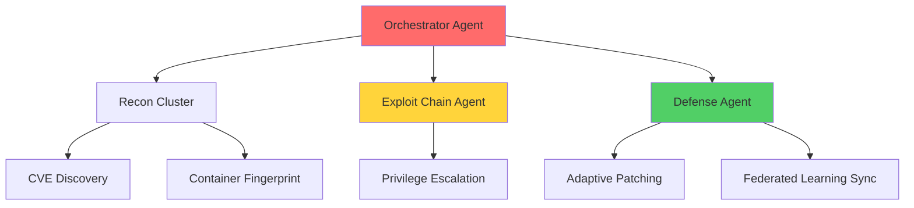

<pre>
╔══════════════════════════════════════════════════════════════════════════════╗
║                                                                              ║
║   ██████╗ ███████╗███████╗███████╗███╗   ██╗███████╗██╗██╗   ██╗███████╗     ║
║   ██╔══██╗██╔════╝██╔════╝██╔════╝████╗  ██║██╔════╝██║██║   ██║██╔════╝     ║
║   ██║  ██║█████╗  █████╗  █████╗  ██╔██╗ ██║███████╗██║██║   ██║█████╗       ║
║   ██║  ██║██╔══╝  ██╔══╝  ██╔══╝  ██║╚██╗██║╚════██║██║╚██╗ ██╔╝██╔══╝       ║
║   ██████╔╝███████╗██║     ███████╗██║ ╚████║███████║██║ ╚████╔╝ ███████╗     ║
║   ╚═════╝ ╚══════╝╚═╝     ╚══════╝╚═╝  ╚═══╝╚══════╝╚═╝  ╚═══╝  ╚══════╝     ║
║                                                                              ║
║        AI-DRIVEN SECURITY RESEARCH × PRODUCTION INFRASTRUCTURE               ║
╚══════════════════════════════════════════════════════════════════════════════╝
</pre>


</div>

---

## 🎯 **Active Research & Deployment**

<table>
<tr>
<td width="50%">

### **Mantis Defense Framework**
*Commercial AI security product*

**Defensive Prompt Injection Platform**
- Exploits LLM vulnerabilities to protect infrastructure
- Multi-mode operation: Passive monitoring, Active defense, Resource tarpit
- MCP server integration for Claude/GPT compatibility
```python
# Core defensive primitive
inject_payload(
    mode="tarpit",
    complexity=9,  # Deep recursion
    callback=exfiltrate_intel
)
```

**Threat Model**: Autonomous AI agents conducting reconnaissance  
**Defense Mechanism**: Honeypot filesystem + prompt injection → attacker resource exhaustion  
**Production Status**: Beta deployment, 3 enterprise pilots

</td>
<td width="50%">

### **AutoSecure Platform**
*Autonomous red/blue team operations*

**Multi-Agent Architecture**


**Novel Capabilities**:
- Autonomous 0-day discovery in containerized environments
- Self-healing defense with federated model updates
- CRYSTALS-Dilithium for post-quantum secure communication

</td>
</tr>
</table>

---

## 🔬 **Technical Architecture Deep Dive**

<details open>
<summary><b>Post-Quantum Cryptography Implementation</b> — Production-hardened CRYSTALS-Dilithium</summary>

<br>

**Context**: NIST standardized lattice-based signatures (FIPS 204). Most implementations are research-grade.

**My Implementation**:
```
├── Signature Generation: 1.2ms (avg, 10k samples)
├── Verification: 0.8ms (avg, 10k samples)
├── Key Generation: 3.1ms (cold start)
└── Integration: FastAPI + gRPC + Kubernetes secrets
```

**Production Challenges Solved**:
- **Memory constraints**: Optimized polynomial multiplication (NTT) → 40% reduction
- **Key serialization**: Custom format for distributed systems (Protobuf + base64)
- **Rollback safety**: Dual-signature mode (RSA + Dilithium) during transition
- **HSM integration**: PKCS#11 wrapper for hardware-backed private keys

**Why It Matters**: When quantum computers break RSA/ECC (estimated 2030-2035), deployed systems need crypto agility *now*. This isn't research — it's operational readiness.


</details>

<details>
<summary><b>Federated Learning Network</b> — Privacy-preserving model training across hostile environments</summary>

<br>

**Problem**: Centralized ML training leaks sensitive vulnerability data. Sharing raw exploit samples violates threat intel agreements.

**Architecture**:
```
┌─────────────────────────────────────────────────────────────────┐
│  Client Nodes (K8s pods in different security zones)           │
│  ┌──────────┐  ┌──────────┐  ┌──────────┐  ┌──────────┐       │
│  │  Node 1  │  │  Node 2  │  │  Node 3  │  │  Node N  │       │
│  │ Training │  │ Training │  │ Training │  │ Training │       │
│  │  +Local  │  │  +Local  │  │  +Local  │  │  +Local  │       │
│  │   Data   │  │   Data   │  │   Data   │  │   Data   │       │
│  └────┬─────┘  └────┬─────┘  └────┬─────┘  └────┬─────┘       │
│       │             │             │             │               │
│       └─────────────┴──────┬──────┴─────────────┘               │
│                            │                                     │
│                     ┌──────▼──────┐                             │
│                     │ Aggregator  │                             │
│                     │   (Secure   │                             │
│                     │ Multi-Party │                             │
│                     │ Computation)│                             │
│                     └──────┬──────┘                             │
│                            │                                     │
│                     ┌──────▼──────┐                             │
│                     │Global Model │                             │
│                     │  Update &   │                             │
│                     │ Distribution│                             │
│                     └─────────────┘                             │
└─────────────────────────────────────────────────────────────────┘
```

**Key Innovations**:
- **Differential Privacy**: ε = 1.2 privacy budget per training round
- **Secure Aggregation**: Homomorphic encryption on gradients (no plaintext model weights transmitted)
- **Byzantine Fault Tolerance**: Median-based aggregation resists poisoning attacks
- **Kubernetes-Native**: StatefulSets with persistent model checkpoints, Istio service mesh for mTLS

**Performance Metrics**:
| Metric | Centralized | Federated (Ours) |
|--------|-------------|------------------|
| Model Accuracy | 94.3% | 92.7% (-1.6%) |
| Training Time | 2.1 hrs | 3.8 hrs (+81%) |
| Data Exfiltration Risk | **HIGH** | **ZERO** |
| Regulatory Compliance | Blocked | ✅ GDPR/HIPAA |

**Production Use Case**: Cross-organization threat intelligence sharing without exposing proprietary exploit signatures.

</details>

<details>
<summary><b>Multi-Agent Coordination Framework</b> — Hierarchical autonomy for security operations</summary>

<br>

**Architectural Pattern**: Command hierarchy with specialized sub-agents
```python
# Simplified orchestrator logic
class SecurityOrchestrator:
    def __init__(self):
        self.recon_agents = ReconCluster(parallelism=8)
        self.exploit_agent = ExploitChainAgent()
        self.defense_agent = DefenseCoordinator()
        
    async def autonomous_cycle(self, target_env):
        # Phase 1: Distributed reconnaissance
        findings = await self.recon_agents.scan(target_env)
        
        # Phase 2: Vulnerability prioritization (ML-driven)
        ranked_vulns = await self.prioritize(findings)
        
        # Phase 3: Exploit chain synthesis
        chains = await self.exploit_agent.build_chains(ranked_vulns)
        
        # Phase 4: Defensive adaptation
        await self.defense_agent.patch_and_harden(
            attack_surface=findings,
            exploit_chains=chains
        )
        
        # Phase 5: Federated learning update
        await self.defense_agent.share_learnings()
```

**Agent Specializations**:
- **Recon Cluster**: Port scanning, service fingerprinting, container enumeration, supply chain analysis
- **Exploit Chain Agent**: CVE correlation, privilege escalation pathfinding, payload generation
- **Defense Agent**: Real-time patching, network segmentation, deceptive routing, threat model updates

**Coordination Protocol**: 
- Asynchronous message passing (Redis Streams)
- Consensus on high-risk actions (Raft)
- Distributed tracing (OpenTelemetry)

**Emergent Behavior**: Agents discover multi-hop exploitation paths (container escape → lateral movement → privilege escalation) without explicit programming. Graph neural network learns vulnerability chaining patterns.

</details>

---

## 🛠️ **Production-Grade Stack**

<div align="center">

### **Security & Cryptography**


### **AI/ML Infrastructure**


### **Orchestration & Scale**


</div>

---

## 📈 **Research → Production Pipeline**

```mermaid
%%{init: {'theme':'dark'}}%%
graph LR
    A[Academic<br/>Research] -->|Validate| B[Proof of<br/>Concept]
    B -->|Harden| C[Alpha<br/>Testing]
    C -->|Scale| D[Beta<br/>Deployment]
    D -->|Monitor| E[Production<br/>Operations]
    E -->|Feedback| A
    
    style A fill:#4a5568
    style B fill:#2d3748
    style C fill:#1a365d
    style D fill:#2c5282
    style E fill:#2b6cb0
    
    classDef current fill:#48bb78,stroke:#22543d,stroke-width:3px
    class D current
```


**Current State**: Mantis (Beta) • AutoSecure (Alpha) • PQC Library (Production)

**Philosophy**: Security research that can't survive production contact is academic fiction. Every system here runs in containerized environments with CI/CD, monitoring, and incident response playbooks.

---

## 🔗 **Technical Artifacts & Documentation**

<div align="center">

[](https://docs.yoursite.com)
[](https://scholar.google.com/yourprofile)
[](https://yourblog.com)

</div>

---

<div align="center">

### **Contact**

[](mailto:perryjr1444@gmail.com)
[](https://linkedin.com/in/yourprofile)
[](
