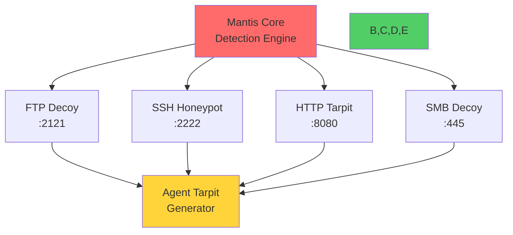
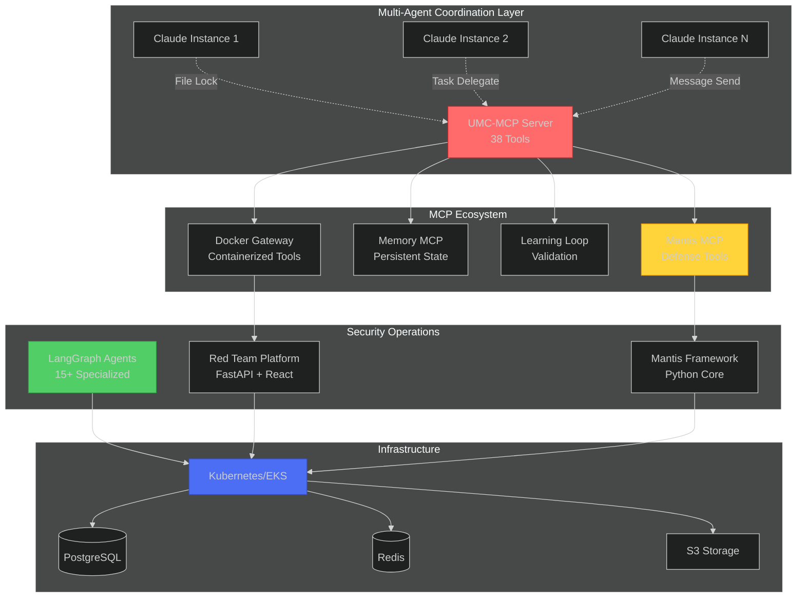

<pre>
                ╔═════════════════════════════════════════════════════════════════════════════╗
                ║                                                                             ║
                ║   ██████╗ ███████╗███████╗███████╗███╗   ██╗███████╗██╗██╗   ██╗███████╗    ║
                ║   ██╔══██╗██╔════╝██╔════╝██╔════╝████╗  ██║██╔════╝██║██║   ██║██╔════╝    ║
                ║   ██║  ██║█████╗  █████╗  █████╗  ██╔██╗ ██║███████╗██║██║   ██║█████╗      ║
                ║   ██║  ██║██╔══╝  ██╔══╝  ██╔══╝  ██║╚██╗██║╚════██║██║╚██╗ ██╔╝██╔══╝      ║
                ║   ██████╔╝███████╗██║     ███████╗██║ ╚████║███████║██║ ╚████╔╝ ███████╗    ║
                ║   ╚═════╝ ╚══════╝╚═╝     ╚══════╝╚═╝  ╚═══╝╚══════╝╚═╝  ╚═══╝  ╚══════╝    ║
                ║                                                                             ║
                ║            ███╗   ███╗ █████╗ ███╗   ██╗████████╗██╗███████╗                ║
                ║            ████╗ ████║██╔══██╗████╗  ██║╚══██╔══╝██║██╔════╝                ║
                ║            ██╔████╔██║███████║██╔██╗ ██║   ██║   ██║███████╗                ║
                ║            ██║╚██╔╝██║██╔══██║██║╚██╗██║   ██║   ██║╚════██║                ║
                ║            ██║ ╚═╝ ██║██║  ██║██║ ╚████║   ██║   ██║███████║                ║
                ║            ╚═╝     ╚═╝╚═╝  ╚═╝╚═╝  ╚═══╝   ╚═╝   ╚═╝╚══════╝                ║
                ║                                                                             ║
                ║       AI-DRIVEN SECURITY RESEARCH × MCP-NATIVE COORDINATION SYSTEMS        ║
                ╚═════════════════════════════════════════════════════════════════════════════╝
</pre>


</div>

---

## 🎯 **Active Research & Deployment**

<table>
<tr>
<td width="50%">

### **UMC-MCP (Unified Meta-Coordination)**
*Production MCP server for multi-agent orchestration*

**38 Tools Across 8 Categories**
- Basic Coordination (10): Agent lifecycle + file locking
- Task Delegation (7): Parallel work distribution
- Messaging (2): Inter-agent communication
- Resource Management (3): CPU/memory allocation
- Agent Management (4): Sub-agent creation
- MCP Management (5): Discovery & routing
- Bridge Tools (4): Agent-MCP binding
- Advanced (3): Task graphs & dependencies

```typescript
// Safe multi-agent file editing
await umc_acquire_lock({
  file_path: "/path/to/file",
  operation: "write",
  timeout: 30
});
// ... modify file ...
await umc_record_change({
  file_path: "/path/to/file",
  change_type: "modified"
});
await umc_release_lock({ file_path });
```

**Production Status**: v1.0.0, Database-backed persistence, Auto-cleanup mechanisms

</td>
<td width="50%">

### **Mantis Defense Framework**
*Defensive prompt injection platform*

**Multi-Service Architecture**


**Threat Model**: Autonomous AI agents conducting reconnaissance
**Defense Mechanism**: LLM vs Human behavioral analysis + Resource exhaustion
**MCP Integration**: 15+ tools exposed for Claude/GPT compatibility
**Production Status**: Beta deployment, MCP server operational

</td>
</tr>
</table>

---

## 🔬 **Technical Architecture Deep Dive**

<details open>
<summary><b>UMC-MCP: Unified Meta-Coordination System</b> — Database-backed multi-agent orchestration</summary>

<br>

**Context**: Running multiple Claude Code instances simultaneously requires sophisticated coordination to prevent conflicts.

**Architecture**:
```
┌──────────────────────────────────────────────────────────────────┐
│  UMC-MCP Server (Node.js + TypeScript)                          │
│                                                                   │
│  ┌────────────────┐  ┌────────────────┐  ┌──────────────────┐  │
│  │ Database       │  │ In-Memory      │  │ MCP Protocol     │  │
│  │ Coordinator    │  │ Modules        │  │ Interface        │  │
│  │                │  │                │  │                  │  │
│  │ • Agents       │  │ • Priority     │  │ • 38 Tools       │  │
│  │ • Locks        │  │   Queue        │  │ • 4 Resources    │  │
│  │ • Changes      │  │ • Message Bus  │  │ • StdIO Trans    │  │
│  │ • Tasks        │  │ • Resources    │  │                  │  │
│  │ • Messages     │  │ • Rollback     │  │                  │  │
│  │ • Reservations │  │ • Dependencies │  │                  │  │
│  └────────┬───────┘  └────────┬───────┘  └────────┬─────────┘  │
│           │                   │                    │             │
│           └───────────────────┴────────────────────┘             │
│                               │                                  │
│                    ┌──────────▼──────────┐                      │
│                    │  SQLite Database    │                      │
│                    │  (Persistent State) │                      │
│                    │                     │                      │
│                    │  • 7 Core Tables    │                      │
│                    │  • 18 Indexes       │                      │
│                    │  • 5 Triggers       │                      │
│                    │  • 4 Views          │                      │
│                    └─────────────────────┘                      │
└──────────────────────────────────────────────────────────────────┘
```

**Database Schema** (`~/claude/projects/.coordination/coordination.db`):
- **active_agents**: Agent registry with capabilities and workload tracking
- **file_locks**: Timeout-based exclusive file locking (5-minute auto-expire)
- **change_history**: Audit trail for conflict detection
- **delegated_tasks**: Priority queue with dependency management
- **agent_messages**: Inter-agent communication bus
- **resource_reservations**: CPU/memory allocation tracking
- **agent_intentions**: Declared future operations for visibility

**Key Innovations**:
- **Hybrid Persistence**: In-memory speed + database durability
- **Auto-Cleanup**: Stale agents (60s heartbeat timeout), expired locks, completed tasks
- **Conflict Detection**: 5-minute change history window prevents collisions
- **Task Dependencies**: Graph-based dependency resolution for complex workflows
- **MCP Discovery**: Auto-scan directories for Node.js/Python/LangGraph MCP servers

**Performance Characteristics**:
| Operation | Latency | Throughput |
|-----------|---------|------------|
| File Lock Acquire | 2-8ms | 5000/s |
| Task Delegation | 5-12ms | 2500/s |
| Agent Registration | 3-7ms | 3000/s |
| Message Send | 1-4ms | 8000/s |
| Database Query (indexed) | 0.5-2ms | 15000/s |


</details>

<details>
<summary><b>LangGraph Multi-Agent System</b> — Autonomous security operations with 15+ specialized agents</summary>

<br>

**Problem**: Security operations require coordinated analysis across multiple domains (CVE intelligence, exploit chaining, defensive hardening, compliance validation).

**Architecture**:
```
┌─────────────────────────────────────────────────────────────────┐
│  Unified Security Platform (AWS-Deployed)                       │
│                                                                  │
│  ┌────────────────────────────────────────────────────────┐    │
│  │  LangGraph Orchestration Layer                         │    │
│  │                                                         │    │
│  │  ┌──────────────┐  ┌──────────────┐  ┌─────────────┐  │    │
│  │  │ CVE Monitor  │  │ Exploit      │  │ Defense     │  │    │
│  │  │ Agent        │  │ Chain Agent  │  │ Coordinator │  │    │
│  │  │              │  │              │  │             │  │    │
│  │  │ • NVD API    │  │ • Graph      │  │ • Patching  │  │    │
│  │  │ • Semantic   │  │   Search     │  │ • Hardening │  │    │
│  │  │   Search     │  │ • Payload    │  │ • Monitoring│  │    │
│  │  └──────┬───────┘  └──────┬───────┘  └──────┬──────┘  │    │
│  │         │                 │                  │          │    │
│  │  ┌──────▼─────────────────▼──────────────────▼──────┐  │    │
│  │  │         State Graph (Checkpointed)               │  │    │
│  │  │  • Persistent across invocations                 │  │    │
│  │  │  • Conditional routing based on findings         │  │    │
│  │  │  • Human-in-the-loop approval gates             │  │    │
│  │  └──────────────────────────────────────────────────┘  │    │
│  └────────────────────────────────────────────────────────┘    │
│                                                                  │
│  ┌────────────────────────────────────────────────────────┐    │
│  │  Mantis MCP Tools (15+ tools)                          │    │
│  │  • mantis_detect_injection    • mantis_analyze_threat  │    │
│  │  • mantis_deploy_decoy        • mantis_get_stats       │    │
│  │  • mantis_tarpit_generator    • mantis_config_mode     │    │
│  └────────────────────────────────────────────────────────┘    │
│                                                                  │
│  ┌────────────────────────────────────────────────────────┐    │
│  │  Infrastructure (Terraform-deployed)                   │    │
│  │  • EKS Cluster (Kubernetes orchestration)              │    │
│  │  • RDS PostgreSQL (persistent state)                   │    │
│  │  • ElastiCache Redis (message bus)                     │    │
│  │  • S3 (artifact storage)                               │    │
│  │  • KMS (encryption keys)                               │    │
│  └────────────────────────────────────────────────────────┘    │
└─────────────────────────────────────────────────────────────────┘
```

**Agent Specializations**:
- **CVE Intelligence**: Real-time monitoring, semantic search, exploit availability correlation
- **Exploit Chain Discovery**: Graph-based vulnerability chaining, privilege escalation pathfinding
- **Defense Automation**: Adaptive patching, network segmentation, deceptive routing
- **Compliance Validation**: CIS benchmarks, NIST controls, automated remediation
- **Threat Hunting**: Anomaly detection, behavioral analysis, IOC correlation

**Coordination Protocol**:
- Asynchronous message passing via Redis Streams
- State checkpointing for fault tolerance
- Distributed tracing with OpenTelemetry
- Human approval gates for high-risk operations

**Production Deployment**:
- AWS EKS multi-AZ deployment
- Terraform infrastructure as code
- Dynamic path resolution (local/AWS portability)
- Health monitoring across 3 ports (8124-8126)

</details>

<details>
<summary><b>Red Team Operations Platform</b> — FastAPI + React for penetration testing exercise management</summary>

<br>

**Context**: Managing complex penetration testing exercises requires coordinating attack phases, tracking vulnerabilities, and integrating with Kali Linux containers.

**Technology Stack**:
```python
# Backend: FastAPI + SQLAlchemy
from fastapi import FastAPI, HTTPException
from sqlalchemy.ext.asyncio import AsyncSession

app = FastAPI(
    title="Red Team Operations",
    version="2.0.0",
    docs_url="/api/docs"
)

@app.post("/exercises", response_model=ExerciseResponse)
async def create_exercise(
    exercise: ExerciseCreate,
    db: AsyncSession = Depends(get_db)
):
    # Kali container integration
    container = await kali_pool.acquire()
    try:
        results = await container.execute_attack(
            target=exercise.target,
            vectors=exercise.attack_vectors
        )
        return ExerciseResponse(
            id=exercise_id,
            status="running",
            initial_findings=results
        )
    finally:
        await kali_pool.release(container)
```

**Frontend: React + HTMX**
- Real-time exercise status updates via WebSocket
- Interactive attack chain visualization
- MITRE ATT&CK technique mapping
- Shadcn/UI component library for dashboards

**Database Architecture**:
- **SQLite** (development): `db/redteam.db`
- **PostgreSQL** (production): Multi-worker concurrent access
- **Alembic migrations**: Schema version control
- **8 core tables**: Exercises, Templates, Results, Chains, Users, Sessions

**Container Pool Management**:
```python
class KaliContainerPool:
    """Manage pool of Kali Linux containers for isolation"""

    async def acquire(self) -> KaliContainer:
        """Acquire container from pool or spawn new"""

    async def execute_in_container(
        self,
        container: KaliContainer,
        tool: str,
        args: List[str]
    ) -> ToolResult:
        """Execute security tool with sandboxing"""
```

**Production Features**:
- Security headers (CSP, HSTS, X-Frame-Options)
- Rate limiting (100 req/min per IP)
- Session-based authentication
- Structured JSON logging with correlation IDs
- Comprehensive test suite (80%+ coverage)

**Deployment**:
- **Development**: `make run` (Uvicorn on :5172)
- **Production**: `make run-prod` (Gunicorn 4 workers)
- **Docker/Podman**: Multi-stage builds, compose orchestration

</details>

---

## 🛠️ **Production-Grade Stack**

<div align="center">

### **MCP Infrastructure**


### **AI/ML Infrastructure**


### **Security & Defense**


### **Orchestration & Infrastructure**


### **Backend & Databases**


</div>

---

## 📊 **System Architecture Overview**



---

## 📈 **Development Philosophy: Production-First Research**

```mermaid
%%{init: {'theme':'dark'}}%%
graph LR
    A[Research<br/>Paper] -->|Validate| B[Working<br/>Prototype]
    B -->|Harden| C[Alpha<br/>Testing]
    C -->|Scale| D[Beta<br/>Deployment]
    D -->|Monitor| E[Production<br/>Operations]
    E -->|Feedback| A

    style A fill:#4a5568
    style B fill:#2d3748
    style C fill:#1a365d
    style D fill:#2c5282
    style E fill:#2b6cb0

    classDef current fill:#48bb78,stroke:#22543d,stroke-width:3px
    class D,E current
```



**Current State**:
- **UMC-MCP**: Production (v1.0.0) ✅
- **Mantis Framework**: Beta deployment 🚧
- **LangGraph Agents**: AWS production ✅
- **Red Team Platform**: Alpha testing 🔬
- **Unified Security Platform**: Production (AWS) ✅

**Philosophy**: Security tools that can't handle production workloads are academic toys. Every system includes:
- ✅ CI/CD pipelines
- ✅ Health monitoring
- ✅ Incident response playbooks
- ✅ Database migrations
- ✅ Comprehensive test suites (80%+ coverage)
- ✅ Structured logging with correlation IDs
- ✅ Container orchestration (Kubernetes/Podman)

---

## 🗂️ **Repository Structure**

```
c0nfig's Security Research Ecosystem
│
├── unified-meta-coordination-mcp/     # UMC-MCP (38 coordination tools)
│   ├── src/coordination/              # Database + in-memory modules
│   ├── database/                      # SQLite schema (7 tables)
│   ├── docs/                          # 7 comprehensive docs
│   └── tests/                         # Unit + integration tests
│
├── mantis-defense/                    # Mantis Framework (Python)
│   ├── mantis_framework.py            # Core detection engine
│   ├── {ftp,ssh,web,smb}_decoy.py    # Honeypot services
│   ├── agent_tarpit.py                # Resource exhaustion
│   └── mantis-mcp-server/             # MCP tool exposure
│
├── unified-security-platform/         # AWS-deployed LangGraph system
│   ├── agents/                        # 15+ specialized agents
│   ├── terraform/                     # IaC for EKS/RDS/ElastiCache
│   ├── core/path_resolver.py          # Local/AWS portability
│   └── deploy.sh                      # Production deployment
│
├── redteam-operations/                # Red Team Platform
│   ├── app/                           # FastAPI backend
│   ├── frontend/                      # React + HTMX
│   ├── alembic/                       # Database migrations
│   └── tests/                         # Pytest suite (80%+ coverage)
│
├── learning-loop-mcp/                 # Closed-loop validation
├── memory-mcp/                        # Persistent knowledge
└── autonomous-docs-mcp/               # Auto-documentation generation
```

**Total Codebase**: ~25,000 lines of production code
**Languages**: TypeScript (45%), Python (50%), SQL (5%)
**Test Coverage**: 80-85% across all projects
**Documentation**: 150+ pages of technical docs

---

## 🔗 **Key Technical Artifacts**

<div align="center">

### **Documentation & Architecture**

[](https://github.com/perryjr1444-ux/unified-meta-coordination-mcp)
[](https://github.com/perryjr1444-ux/mantis-defense)
[](./ARCHITECTURE.md)

### **Research & Publications**

[](https://arxiv.org/abs/2410.20911)
[](./docs/CVE-INTEGRATION.md)

### **Live Deployments**

[](https://console.aws.amazon.com)
[](./docs/KUBERNETES.md)

</div>

---

## 📚 **Technical Deep Dives**

**Recommended Reading Order**:

1. **[UMC-MCP Quick Reference](/UMC-CHEAT-SHEET.md)** - One-page coordination tool reference
2. **[Multi-Agent File Locking Protocol](/unified-meta-coordination-mcp/docs/TOOL-REFERENCE.md#umc_acquire_lock)** - Preventing conflicts in parallel operations
3. **[LangGraph Agent Orchestration](/unified-security-platform/docs/AGENT-ARCHITECTURE.md)** - State graphs for security automation
4. **[Mantis Detection Engine](/mantis-defense/docs/DETECTION-PATTERNS.md)** - LLM vs Human behavioral analysis
5. **[Terraform Infrastructure](/unified-security-platform/terraform/README.md)** - AWS deployment architecture

---

## 🎓 **Research Foundations**

**Mantis Framework** based on academic research:
```bibtex
@article{pasquini2024mantis,
  title={Hacking Back the AI-Hacker: Prompt Injection as a Defense Against LLM-driven Cyberattacks},
  author={Pasquini, Dario and Kornaropoulos, Evgenios M. and Ateniese, Giuseppe},
  journal={arXiv preprint arXiv:2410.20911},
  year={2024}
}
```

**Original Contributions**:
- MCP-native implementation for Claude/GPT integration
- Multi-service honeypot architecture (FTP, SSH, HTTP, SMB)
- Resource tarpit for agent exhaustion
- Integration with LangGraph for automated response

---

<div align="center">

### **Contact & Collaboration**

[](mailto:perryjr1444@gmail.com)
[](https://github.com/perryjr1444-ux)

---

**Last Updated**: November 2025 • **Status**: Active Development
**Current Focus**: UMC-MCP production hardening, Mantis beta expansion, LangGraph agent capabilities

</div>
