<div align="center">

<!-- Animated Banner -->


<!-- Glitch Effect Title -->
<h1>
  
</h1>

<!-- Animated Carousel -->


<!-- Live Status -->
<p align="center">
  
  
  
</p>

<!-- GitHub Stats -->


</div>

---

## 🎯 **Research Focus**

The work explores emergent properties in distributed agent coordination, where multiple autonomous processes must synchronize without central authority. Think of it as studying how consciousness might distribute across networked minds—each agent maintains partial state while contributing to collective intelligence.

**Core Questions**:
- How do agents resolve conflicting intentions without deadlock?
- Can behavioral patterns distinguish synthetic from organic actors?
- What happens when defense mechanisms mirror attack patterns?

**Approach**: Build minimal viable infrastructure, observe emergent behaviors, iterate based on what breaks. The goal isn't to prevent all attacks—it's to make attackers reveal themselves through interaction patterns.

---

## 🏗️ **Architecture Philosophy**

<div align="center">

```
┌──────────────────────────────────────────────────────┐
│         The metaverse isn't about scale              │
│         It's about subtle behavioral signals         │
│         that only become visible in aggregate        │
└──────────────────────────────────────────────────────┘
```

</div>

**Design Principles**:

1. **Coordination over Control**: Systems that coordinate rather than control. File locks that timeout. Task queues that rebalance. Message buses that route probabilistically.

2. **Pattern over Signature**: Don't look for what you know is bad. Look for what feels wrong—timing inconsistencies, perfect syntax, pathological retry behavior.

3. **Defense as Offense**: The best honeypot doesn't look like a honeypot. It looks like a system that's *almost* working, that invites exploration just one level deeper.

4. **Emergence over Engineering**: You can't design security into a complex system. You can only create conditions where security emerges from interaction dynamics.

---

## 💎 **Research Components**

<table>
<tr>
<td width="50%">

### **Coordination Substrate**

Multi-agent systems need shared memory without shared state. The solution involves:
- Optimistic concurrency with conflict detection
- Heartbeat-based liveness (the gaps matter more than the signals)
- Task delegation where agents bid on work
- Message passing that occasionally gets "lossy" on purpose

**Why lossy messaging helps**: Humans retry with variations. Automated systems retry identically. The variance is the signal.

</td>
<td width="50%">

### **Behavioral Differentiation**

Traditional security assumes rational actors. Modern threats act *hyper*-rationally—no typos, no pauses, perfect command recall.

The research question: Can you detect intelligence by its edges, not its core?
- How does timing vary under cognitive load?
- What's the recursion depth limit for human curiosity?
- How do error-handling strategies differ?

**Insight**: Humans give up. Algorithms persevere. This is the asymmetry.

</td>
</tr>
</table>

---

## 🔬 **Active Experiments**

<details>
<summary><b>Experiment 1: Distributed Coordination Without Consensus</b></summary>

<br>

**Hypothesis**: Systems requiring consensus deadlock under Byzantine conditions. Systems requiring only eventual consistency remain available under attack.

**Method**:
- Build coordination layer using database-backed state + in-memory reconciliation
- Introduce Byzantine agents (randomly lie about file locks, claim completed tasks)
- Measure time-to-recovery vs. work completion ratio

**Early Results**:
- Lock timeouts prevent permanent deadlock
- Stale agent cleanup requires conservative thresholds (false positives destroy productivity)
- Message ordering matters less than you'd think

**Implication**: Real-world agent systems should optimize for availability over consistency. The cost of retry is lower than the cost of coordination.

</details>

<details>
<summary><b>Experiment 2: Honeypots as Behavioral Mirrors</b></summary>

<br>

**Hypothesis**: You can't distinguish attacker from defender by *what* they do. Only by *how* they do it.

**Method**:
- Deploy services that respond slowly, with realistic errors
- Inject subtle contradictions in responses (directory listings that change, files that appear/disappear)
- Track interaction patterns: does the client pause to think? Do they retry the exact same command?

**Observation**:
- Human attackers get frustrated and skip ahead
- Automated reconnaissance backtracks systematically
- LLM-driven tools follow injected suggestions with high fidelity

**Interesting Failure**: Over-complicating the misdirection makes humans suspicious faster. The sweet spot is *almost* working, not obviously broken.

</details>

<details>
<summary><b>Experiment 3: Autonomous Graph Navigation</b></summary>

<br>

**Hypothesis**: Security operations are graph search problems (CVEs → exploits → patches), but manual orchestration doesn't scale.

**Method**:
- Model security workflow as state machine
- Give agents tools to query vulnerability databases, chain exploits, propose remediations
- Add human approval gates before destructive operations
- Measure decision quality vs. human-only baseline

**Challenge**:
- Agents default to exhaustive search (expensive)
- Pruning requires domain knowledge (hard to encode)
- Approval gates become bottlenecks if too granular

**Current Direction**: Teach agents to estimate blast radius and ask for approval only when exceeding thresholds.

</details>

---

## 🛠️ **Technical Stack**

<div align="center">

### **Languages & Frameworks**


### **Infrastructure**


### **Data Layer**


</div>

---

## 📊 **Research → Production**

```mermaid
%%{init: {'theme':'dark'}}%%
graph LR
    A[💡 Hypothesis] -->|Prototype| B[🧪 Experiment]
    B -->|Data| C[📊 Analysis]
    C -->|Refine| A
    C -->|Validates| D[🏗️ Harden]
    D -->|Deploy| E[🔍 Observe]
    E -->|Anomalies| A

    style A fill:#4a5568,stroke:#2d3748
    style B fill:#2c5282,stroke:#2b6cb0
    style C fill:#2d3748,stroke:#1a202c
    style D fill:#1a365d,stroke:#153e75
    style E fill:#2b6cb0,stroke:#3182ce

    classDef active fill:#48bb78,stroke:#38a169,stroke-width:4px
    class B,C,E active
```

<div align="center">



</div>

**Philosophy**: Production *is* research. Real attackers probe differently than simulations. The best data comes from systems deployed just long enough to attract attention but not long enough to suffer real damage.

---

## 🎓 **Academic Foundation**

Research builds on work in:
- Distributed systems (eventual consistency, Byzantine fault tolerance)
- Behavioral analysis (LLM vs human interaction patterns)
- Game theory (defender-attacker dynamics, signaling games)
- Prompt engineering (defensive injection, misdirection techniques)

**Key Papers**:
- Pasquini et al., "Hacking Back the AI-Hacker" (arXiv:2410.20911)
- Lamport, "Time, Clocks, and Ordering of Events" (foundational for coordination)
- Brewer, "CAP Theorem" (availability vs consistency trade-offs)

**Novel Contributions**: Applying coordination theory to multi-agent security, using honeypots as behavioral signal amplifiers, treating defense as Bayesian inference over interaction traces.

---

## 🗂️ **Repository Organization**

<div align="center">

```
research-infrastructure/
│
├── coordination/          # Multi-agent synchronization experiments
├── behavioral/            # Pattern detection prototypes
├── orchestration/         # Autonomous workflow engines
├── infrastructure/        # Deployment automation
└── analysis/              # Data pipelines and notebooks
```

</div>

**Note**: Detailed implementation is intentionally not public. What's here is conceptual—enough to collaborate on ideas, not enough to replicate production systems. If you're interested in specific techniques, reach out directly.

---

## 📬 **Contact & Collaboration**

<div align="center">

[](mailto:perryjr1444@gmail.com)
[](https://github.com/perryjr1444-ux)

---

**🔬 Interested in**: Defensive security research • Distributed systems • Behavioral analysis • Agent coordination

**📚 Reading**: Papers on Byzantine consensus, LLM jailbreaking, network flow analysis, prompt injection dynamics

**💬 Open to**: Research collaborations, infrastructure discussions, security design reviews


</div>


