<div align="center">

<pre>
╔═══════════════════════════════════════════════════════════════════════════════════════╗
║                                                                                       ║
║     ███████╗███████╗ ██████╗██╗   ██╗██████╗ ██╗████████╗██╗   ██╗                  ║
║     ██╔════╝██╔════╝██╔════╝██║   ██║██╔══██╗██║╚══██╔══╝╚██╗ ██╔╝                  ║
║     ███████╗█████╗  ██║     ██║   ██║██████╔╝██║   ██║    ╚████╔╝                   ║
║     ╚════██║██╔══╝  ██║     ██║   ██║██╔══██╗██║   ██║     ╚██╔╝                    ║
║     ███████║███████╗╚██████╗╚██████╔╝██║  ██║██║   ██║      ██║                     ║
║     ╚══════╝╚══════╝ ╚═════╝ ╚═════╝ ╚═╝  ╚═╝╚═╝   ╚═╝      ╚═╝                     ║
║                                                                                       ║
║              ███╗   ███╗███████╗████████╗ █████╗ ██╗   ██╗███████╗██████╗ ███████╗  ║
║              ████╗ ████║██╔════╝╚══██╔══╝██╔══██╗██║   ██║██╔════╝██╔══██╗██╔════╝  ║
║              ██╔████╔██║█████╗     ██║   ███████║██║   ██║█████╗  ██████╔╝███████╗  ║
║              ██║╚██╔╝██║██╔══╝     ██║   ██╔══██║╚██╗ ██╔╝██╔══╝  ██╔══██╗╚════██║  ║
║              ██║ ╚═╝ ██║███████╗   ██║   ██║  ██║ ╚████╔╝ ███████╗██║  ██║███████║  ║
║              ╚═╝     ╚═╝╚══════╝   ╚═╝   ╚═╝  ╚═╝  ╚═══╝  ╚══════╝╚═╝  ╚═╝╚══════╝  ║
║                                                                                       ║
║   ┌─────────────────────────────────────────────────────────────────────────────┐   ║
║   │  UMC-MCP  │  MANTIS  │  LANGGRAPH  │  RED TEAM  │  LEARNING LOOP  │  MCP   │   ║
║   │  38 Tools │  Defense │  15+ Agents │  Platform  │  Validation     │  Stack │   ║
║   └─────────────────────────────────────────────────────────────────────────────┘   ║
║                                                                                       ║
║              🔐 AI-Driven Security Research × Production Infrastructure              ║
║                        MCP-Native Architecture • 25K+ LOC                            ║
╚═══════════════════════════════════════════════════════════════════════════════════════╝
</pre>


</div>

---

## 🎯 **Security Metaverse Ecosystem**

<div align="center">

```
┌──────────────────────────────────────────────────────────────────────────────┐
│                    UNIFIED SECURITY METAVERSE                                │
│                                                                              │
│  ┌─────────────┐   ┌─────────────┐   ┌─────────────┐   ┌─────────────┐    │
│  │  UMC-MCP    │◄──┤   MANTIS    │◄──┤  LANGGRAPH  │◄──┤  RED TEAM   │    │
│  │ Coordinator │   │   Defense   │   │   Agents    │   │  Platform   │    │
│  └──────┬──────┘   └──────┬──────┘   └──────┬──────┘   └──────┬──────┘    │
│         │                 │                  │                  │            │
│         └─────────────────┴──────────────────┴──────────────────┘            │
│                                    │                                         │
│                         ┌──────────▼──────────┐                             │
│                         │   MCP ECOSYSTEM     │                             │
│                         │  Memory • Learning  │                             │
│                         │  Docker • Terraform │                             │
│                         └─────────────────────┘                             │
└──────────────────────────────────────────────────────────────────────────────┘
```

</div>

<table>
<tr>
<td width="33%">

### 🧠 **UMC-MCP**
*Multi-Agent Orchestration*

**38 Coordination Tools**
```
├─ Agent Lifecycle
├─ File Locking
├─ Task Delegation
├─ Messaging
├─ Resources
├─ Sub-Agents
├─ MCP Routing
└─ Dependencies
```


</td>
<td width="33%">

### 🛡️ **MANTIS**
*Defensive AI Security*

**Prompt Injection Defense**
```
├─ LLM Detection
├─ FTP Honeypot :2121
├─ SSH Decoy :2222
├─ HTTP Tarpit :8080
├─ SMB Decoy :445
├─ Agent Tarpit
├─ MCP Tools (15+)
└─ Real-time Analysis
```


</td>
<td width="33%">

### 🤖 **LANGGRAPH**
*Autonomous Security Ops*

**15+ Specialized Agents**
```
├─ CVE Intelligence
├─ Exploit Chains
├─ Defense Automation
├─ Compliance Audit
├─ Threat Hunting
├─ State Graphs
├─ AWS Deployment
└─ Checkpointing
```


</td>
</tr>
</table>

---

## 🏗️ **Architecture Overview**

<div align="center">


</div>

---

## 💎 **Core Systems Deep Dive**

<details open>
<summary><b>🧠 UMC-MCP: Unified Meta-Coordination</b> — The nervous system of the metaverse</summary>

<br>

### **Purpose**
Prevents conflicts when multiple Claude instances work simultaneously. Database-backed coordination with 38 specialized tools.

### **Architecture**

<div align="center">

```
┌──────────────────────────────────────────────────────────────────┐
│                    UMC-MCP Server                                │
│                  (TypeScript + SQLite)                           │
│                                                                   │
│  ┌────────────────┐  ┌────────────────┐  ┌──────────────────┐  │
│  │   Database     │  │   In-Memory    │  │   MCP Protocol   │  │
│  │  Coordinator   │  │    Modules     │  │    Interface     │  │
│  ├────────────────┤  ├────────────────┤  ├──────────────────┤  │
│  │ • Agents       │  │ • Priority Q   │  │ • 38 Tools       │  │
│  │ • Locks        │  │ • Message Bus  │  │ • 4 Resources    │  │
│  │ • Changes      │  │ • Resources    │  │ • StdIO Trans    │  │
│  │ • Tasks        │  │ • Rollback     │  │                  │  │
│  │ • Messages     │  │ • Dependencies │  │                  │  │
│  └────────┬───────┘  └────────┬───────┘  └────────┬─────────┘  │
│           └──────────────┬─────────────────────────┘             │
│                          ▼                                       │
│           ┌──────────────────────────────┐                      │
│           │   SQLite Database            │                      │
│           │   ~/claude/.coordination/    │                      │
│           │                               │                      │
│           │   7 Tables  │  18 Indexes    │                      │
│           │   5 Triggers │  4 Views      │                      │
│           └──────────────────────────────┘                      │
└──────────────────────────────────────────────────────────────────┘
```

</div>

### **Tool Categories**

| Category | Tools | Purpose |
|----------|-------|---------|
| **Basic Coordination** | 10 | Agent lifecycle + file locking |
| **Task Delegation** | 7 | Parallel work distribution |
| **Messaging** | 2 | Inter-agent communication |
| **Resource Management** | 3 | CPU/memory allocation |
| **Agent Management** | 4 | Sub-agent creation |
| **MCP Management** | 5 | Discovery & routing |
| **Bridge Tools** | 4 | Agent-MCP binding |
| **Advanced** | 3 | Task graphs & dependencies |

### **Performance**

| Operation | Latency | Throughput |
|-----------|---------|------------|
| Lock Acquire | 2-8ms | 5000/s |
| Task Delegate | 5-12ms | 2500/s |
| Agent Register | 3-7ms | 3000/s |
| Message Send | 1-4ms | 8000/s |

### **Code Example**

```typescript
// Safe multi-agent file editing workflow
await umc_acquire_lock({
  file_path: "/path/to/file",
  operation: "write",
  timeout: 30
});

// Modify file with Write tool
await umc_record_change({
  file_path: "/path/to/file",
  change_type: "modified"
});

await umc_release_lock({ file_path: "/path/to/file" });
```

**Tech Stack**: TypeScript 5.7 • SQLite 3.x • MCP SDK 1.0.4 • Better-sqlite3
**Status**: ✅ Production (v1.0.0) • Database-backed • Auto-cleanup

</details>

<details>
<summary><b>🛡️ MANTIS: Defensive Prompt Injection</b> — Hacking back the AI hacker</summary>

<br>

### **Threat Model**
Autonomous AI agents conducting reconnaissance against infrastructure. Traditional defenses fail because LLMs don't trigger signature-based detection.

### **Defense Strategy**
Use prompt injection **as a defense mechanism** to:
1. Detect LLM vs human behavior patterns
2. Deploy honeypot services (FTP, SSH, HTTP, SMB)
3. Exhaust attacker resources with infinite tarpits
4. Exfiltrate intelligence about attack methodology

### **Architecture**

<div align="center">


</div>

### **Detection Patterns**

| Pattern | LLM Behavior | Human Behavior |
|---------|--------------|----------------|
| **File Access** | Sequential enumeration | Random/targeted |
| **Error Handling** | Retry with variations | Give up quickly |
| **Command Syntax** | Perfect formatting | Typos, shortcuts |
| **Timing** | Consistent delays | Variable pauses |
| **Recursion Depth** | Follows injected paths | Stops at errors |

### **MCP Tools**

```python
# Exposed via Mantis MCP Server
mantis_detect_injection(text)      # LLM vs human analysis
mantis_deploy_decoy(service, port) # Launch honeypot
mantis_tarpit_generator(mode)      # Generate infinite loops
mantis_analyze_threat(session_id)  # Threat intelligence
mantis_get_stats()                  # Attack metrics
```

### **Research Foundation**

Based on *"Hacking Back the AI-Hacker"* (Pasquini et al., 2024)
arXiv:2410.20911

**Original Contributions**:
- MCP-native implementation
- Multi-service honeypot cluster
- LangGraph integration for automated response

**Tech Stack**: Python 3.10+ • FastAPI • SQLite • MCP SDK • Asyncio
**Status**: 🚧 Beta Deployment • MCP Server Operational

</details>

<details>
<summary><b>🤖 LangGraph: Autonomous Security Operations</b> — State machines for security automation</summary>

<br>

### **Problem**
Security operations require coordinated analysis across CVE intelligence, exploit chaining, defensive hardening, and compliance validation. Manual orchestration doesn't scale.

### **Solution**
15+ specialized LangGraph agents with persistent state graphs, conditional routing, and human-in-the-loop approval gates.

### **Agent Specializations**

<div align="center">

| Agent | Responsibility | Tools |
|-------|---------------|-------|
| **CVE Monitor** | Real-time NVD monitoring | MCP CVE tools, Semantic search |
| **Exploit Chain** | Vulnerability chaining | Graph search, Payload generation |
| **Defense Automator** | Adaptive patching | Terraform, Kubernetes API |
| **Compliance Auditor** | CIS benchmarks | Checkov, AWS Config |
| **Threat Hunter** | Anomaly detection | Mantis MCP, Behavioral analysis |

</div>

### **State Graph Architecture**

```python
from langgraph.graph import StateGraph

# Define security operations graph
workflow = StateGraph()

workflow.add_node("cve_discovery", cve_monitor_agent)
workflow.add_node("exploit_analysis", exploit_chain_agent)
workflow.add_node("defense_deployment", defense_agent)

# Conditional routing based on severity
workflow.add_conditional_edges(
    "cve_discovery",
    lambda x: "critical" if x.cvss >= 9.0 else "standard",
    {
        "critical": "exploit_analysis",
        "standard": "defense_deployment"
    }
)

# Human approval for high-risk actions
workflow.add_node("human_approval", approval_gate)
workflow.add_edge("exploit_analysis", "human_approval")
```

### **Production Deployment**

**Infrastructure**: AWS EKS Multi-AZ
**Persistence**: RDS PostgreSQL + ElastiCache Redis
**Message Bus**: Redis Streams for agent communication
**Monitoring**: 3 health endpoints (ports 8124-8126)
**IaC**: Terraform modules for reproducible deployment

### **Coordination Protocol**

- ✅ Asynchronous message passing
- ✅ State checkpointing for fault tolerance
- ✅ Distributed tracing (OpenTelemetry)
- ✅ Human approval gates for destructive operations
- ✅ Rollback support with transaction logs

**Tech Stack**: Python 3.10+ • LangGraph • FastAPI • Terraform • AWS
**Status**: ✅ Production (AWS) • 15+ Agents Operational

</details>

<details>
<summary><b>⚔️ Red Team Platform: Penetration Testing Automation</b> — FastAPI + React + Kali integration</summary>

<br>

### **Purpose**
Manage penetration testing exercises with Kali Linux container integration, real-time status tracking, and MITRE ATT&CK mapping.

### **Technology Stack**

**Backend**: FastAPI + SQLAlchemy + Alembic
**Frontend**: React + HTMX + Shadcn/UI
**Containers**: Podman/Docker pool management
**Database**: SQLite (dev) / PostgreSQL (prod)

### **Key Features**

```python
# Kali container pool for isolated execution
class KaliContainerPool:
    async def execute_attack(
        self,
        target: str,
        vectors: List[AttackVector]
    ) -> ExecutionResults:
        container = await self.acquire()
        try:
            results = await container.run_tools(
                nmap=True,
                nuclei=True,
                sqlmap=vectors.includes("sqli")
            )
            return self.parse_results(results)
        finally:
            await self.release(container)
```

### **Architecture**

<div align="center">

```
┌─────────────────────────────────────────────────┐
│           Red Team Platform                     │
│                                                  │
│  ┌──────────────┐        ┌──────────────┐      │
│  │   FastAPI    │◄──────►│    React     │      │
│  │   Backend    │        │   Frontend   │      │
│  └──────┬───────┘        └──────────────┘      │
│         │                                        │
│         ▼                                        │
│  ┌──────────────────────────────────────┐      │
│  │      Kali Container Pool             │      │
│  │  ┌────────┐ ┌────────┐ ┌────────┐   │      │
│  │  │ Kali 1 │ │ Kali 2 │ │ Kali N │   │      │
│  │  └────────┘ └────────┘ └────────┘   │      │
│  └──────────────────────────────────────┘      │
│         │                                        │
│         ▼                                        │
│  ┌──────────────┐                               │
│  │  PostgreSQL  │                               │
│  │  Database    │                               │
│  └──────────────┘                               │
└─────────────────────────────────────────────────┘
```

</div>

### **Security Features**

- ✅ CSP, HSTS, X-Frame-Options headers
- ✅ Rate limiting (100 req/min per IP)
- ✅ Session-based authentication
- ✅ Container isolation for attack execution
- ✅ Structured JSON logging with correlation IDs

### **Deployment**

| Mode | Command | Workers | Port |
|------|---------|---------|------|
| Development | `make run` | 1 (Uvicorn) | 5172 |
| Production | `make run-prod` | 4 (Gunicorn) | 5172 |
| Docker | `make compose-up` | Multi-container | 5172 |

**Tech Stack**: FastAPI • React • PostgreSQL • Podman • Alembic
**Status**: 🔬 Alpha Testing • 80%+ Test Coverage

</details>

---

## 🛠️ **Technology Stack**

<div align="center">

### **MCP Infrastructure**


### **AI/ML Orchestration**


### **Security & Defense**


### **Infrastructure & Orchestration**


### **Backend & Databases**


</div>

---

## 📊 **Development Pipeline**

```mermaid
%%{init: {'theme':'dark'}}%%
graph LR
    A[🔬 Research] -->|Validate| B[🧪 Prototype]
    B -->|Harden| C[🔧 Alpha]
    C -->|Scale| D[🚀 Beta]
    D -->|Monitor| E[✅ Production]
    E -->|Feedback| A

    style A fill:#4a5568,stroke:#2d3748
    style B fill:#2d3748,stroke:#1a202c
    style C fill:#1a365d,stroke:#153e75
    style D fill:#2c5282,stroke:#2b6cb0
    style E fill:#2b6cb0,stroke:#3182ce

    classDef active fill:#48bb78,stroke:#38a169,stroke-width:4px
    class D,E active
```

<div align="center">



</div>

**Current Production Status**:
- ✅ **UMC-MCP**: v1.0.0 Production
- 🚧 **Mantis Framework**: Beta Deployment
- ✅ **LangGraph Agents**: AWS Production
- 🔬 **Red Team Platform**: Alpha Testing
- ✅ **Unified Security Platform**: AWS Production

**Production Standards**:
- ✅ CI/CD pipelines with automated testing
- ✅ Health monitoring across all services
- ✅ Incident response playbooks
- ✅ Database migrations (Alembic)
- ✅ 80%+ test coverage requirement
- ✅ Structured logging with correlation IDs
- ✅ Container orchestration (K8s/Podman)

---

## 🗂️ **Repository Overview**

<div align="center">

```
Security Metaverse Ecosystem
│
├── 🧠 unified-meta-coordination-mcp/    # Coordination nervous system
│   ├── src/coordination/               # 6 core modules (694 lines)
│   ├── database/                       # SQLite schema (7 tables)
│   ├── docs/                           # 150+ pages documentation
│   └── tests/                          # Unit + integration
│
├── 🛡️ mantis-defense/                  # Defensive AI framework
│   ├── mantis_framework.py             # LLM detection engine
│   ├── {ftp,ssh,web,smb}_decoy.py     # Honeypots
│   ├── agent_tarpit.py                 # Resource exhaustion
│   └── mantis-mcp-server/              # MCP tool exposure
│
├── 🤖 unified-security-platform/       # LangGraph automation
│   ├── agents/                         # 15+ specialized agents
│   ├── terraform/                      # AWS IaC
│   ├── core/path_resolver.py           # Local/AWS portability
│   └── deploy.sh                       # Production deployment
│
├── ⚔️ redteam-operations/              # Penetration testing
│   ├── app/                            # FastAPI backend
│   ├── frontend/                       # React + HTMX
│   ├── alembic/                        # DB migrations
│   └── tests/                          # 80%+ coverage
│
├── 🔄 learning-loop-mcp/               # Validation feedback
├── 💾 memory-mcp/                      # Persistent knowledge
└── 📚 autonomous-docs-mcp/             # Auto-documentation
```

</div>

**Metrics**:
- 📝 **Total Codebase**: ~25,000 lines of production code
- 🔧 **Languages**: TypeScript (45%), Python (50%), SQL (5%)
- ✅ **Test Coverage**: 80-85% across all projects
- 📖 **Documentation**: 150+ pages of technical docs
- 🏗️ **Infrastructure**: 3 Kubernetes clusters (AWS EKS)
- 🗄️ **Databases**: 4 production databases (PostgreSQL + SQLite)

---

## 📚 **Documentation & Resources**

<div align="center">

### **Core Documentation**

[](https://github.com/perryjr1444-ux/unified-meta-coordination-mcp)
[](https://github.com/perryjr1444-ux/mantis-defense)
[](./ARCHITECTURE.md)

### **Research Foundations**

[](https://arxiv.org/abs/2410.20911)
[](./docs/CVE-INTEGRATION.md)

### **Live Infrastructure**

[](https://console.aws.amazon.com)
[](./docs/KUBERNETES.md)

</div>

### **Recommended Learning Path**

1. **[UMC-MCP Quick Reference](/UMC-CHEAT-SHEET.md)** - One-page tool reference
2. **[Multi-Agent File Locking](/unified-meta-coordination-mcp/docs/TOOL-REFERENCE.md)** - Conflict prevention
3. **[LangGraph Orchestration](/unified-security-platform/docs/AGENT-ARCHITECTURE.md)** - State graphs
4. **[Mantis Detection Patterns](/mantis-defense/docs/DETECTION-PATTERNS.md)** - LLM analysis
5. **[Infrastructure Deployment](/unified-security-platform/terraform/README.md)** - AWS setup

---

## 🎓 **Academic Foundation**

**Mantis Framework** implementation based on:

```bibtex
@article{pasquini2024mantis,
  title={Hacking Back the AI-Hacker: Prompt Injection as a Defense Against LLM-driven Cyberattacks},
  author={Pasquini, Dario and Kornaropoulos, Evgenios M. and Ateniese, Giuseppe},
  journal={arXiv preprint arXiv:2410.20911},
  year={2024}
}
```

**Original Contributions**:
- ✨ MCP-native implementation for Claude/GPT ecosystem
- ✨ Multi-service honeypot architecture (FTP, SSH, HTTP, SMB)
- ✨ Resource tarpit for agent exhaustion
- ✨ LangGraph integration for automated defensive response
- ✨ Production-hardened deployment on AWS EKS

---

## 📬 **Contact & Collaboration**

<div align="center">

[](mailto:perryjr1444@gmail.com)
[](https://github.com/perryjr1444-ux)

---


**Current Priorities**: UMC-MCP v1.1 features • Mantis beta expansion • LangGraph agent capabilities

</div>
